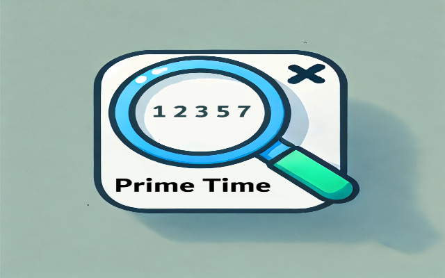

# Prime Time

## What is it?
Prime Time is a Google Chrome and Firefox extension that allows the user to easily find the prime factors of any highlighted number. The extension then returns the prime factors in an easily readable format ready to be copy and pasted anywhere.
## How to use?
Using the default keybind of Ctrl + Shift + F or by inputting the number in the extension itself in the top right the user can send their integer to be prime factorized. It can be installed in the Firefox Add-ons page or through the Chrome Web Store.
## Purpose
Originally Prime Time was created for a friend who wanted an easy way to prime factor numbers quickly in their browser. After being paid for the extension, the development quickly halted as I saw little wrong with the extension at the time. After opening my eyes for once in 2 years I found many blatant flaws that pushed people away from the extension. Motivated by Hack Club Carnival and a desire to revitalize my extension I added many QoL changes to the extension.
## Support the creator
Please support my developing career by doing the following: star the repo. fork the repo, stealing only 50% of my ideas, explaining to me what in the world General number field sieve is and how I can use it t optimize the factoring of larger numbers, how to crack encryption keys with this extension, AND MOST IMPORTANTLY asking everyone you know to **install the extension on both firefox and google** 🙏.
### AI Usage
AI was used in the project for debugging and artwork (*allegedly* my art talent is that of a kindergartener 😭).
